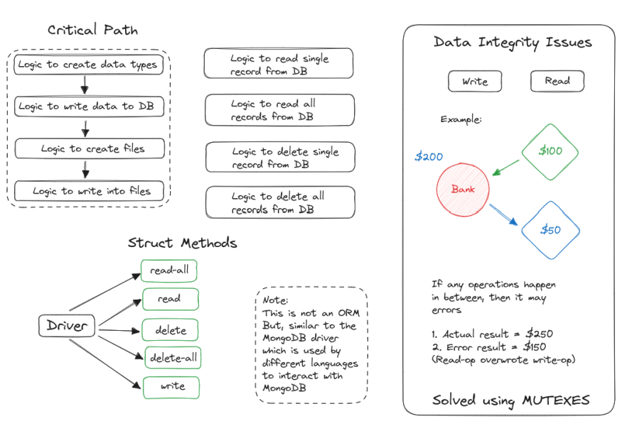

# Building your Own Database

This project aims to simmulate MongoDB's structure of storing data 
in the form of JSON objects. The following diagram should give 
you a view of the system.



## Setup 
```go
go mod init
```
